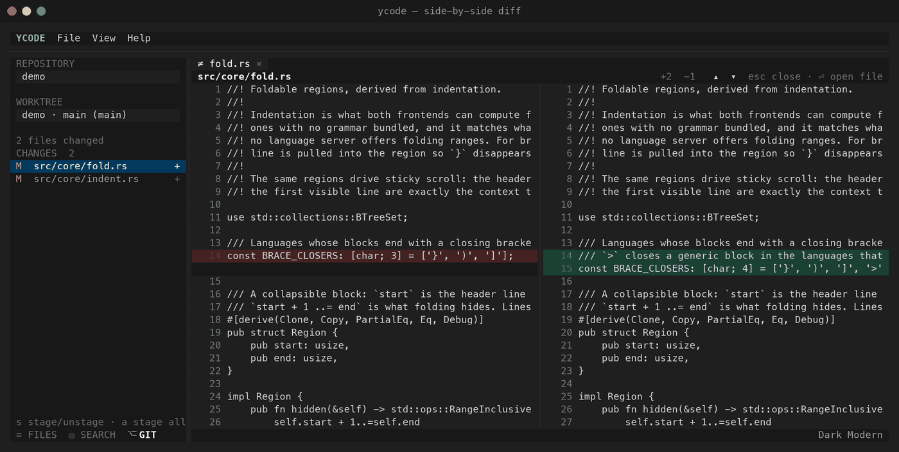
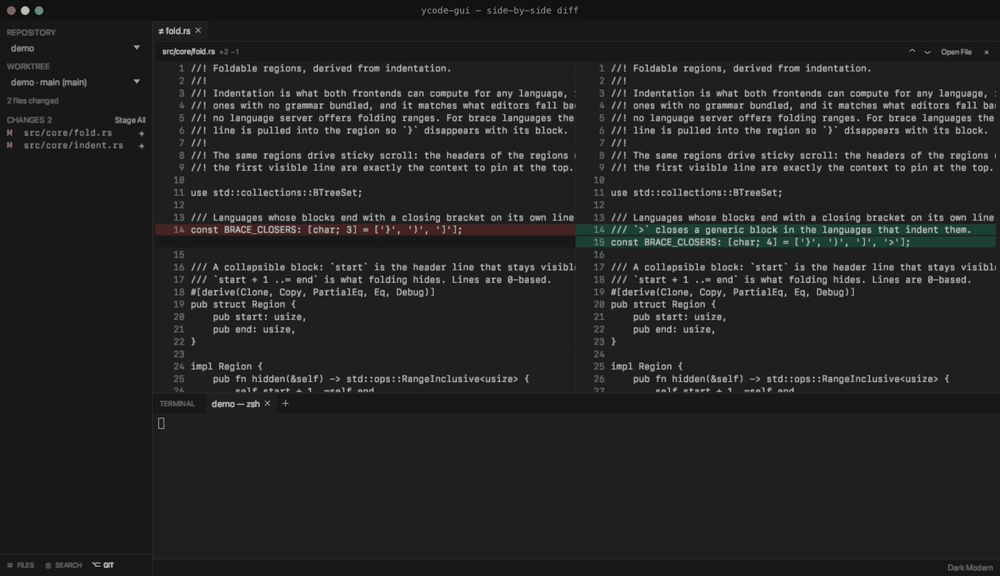
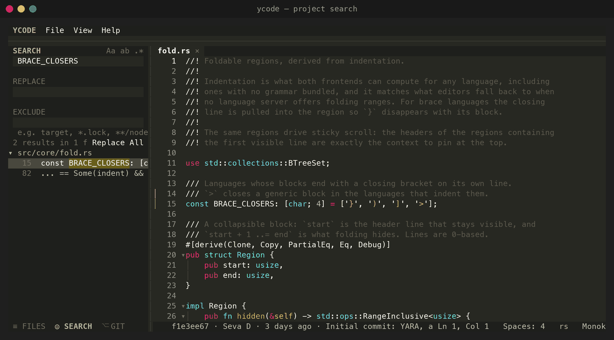
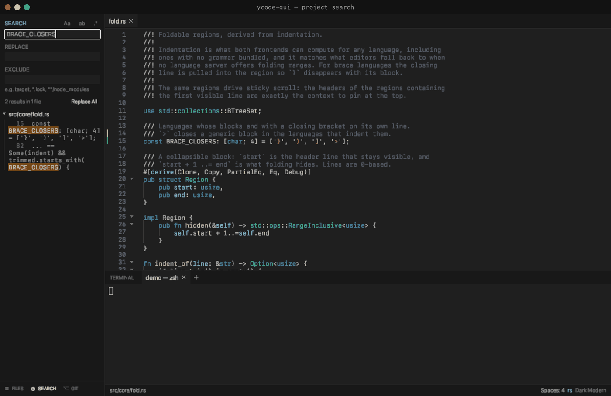
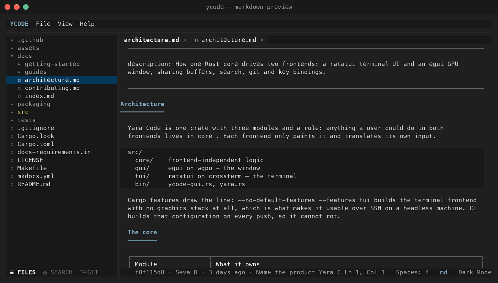
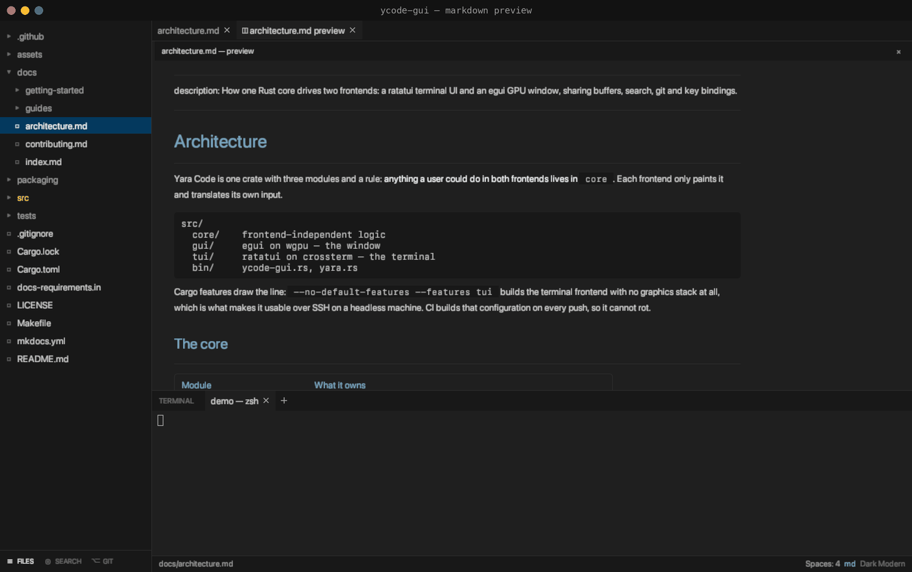
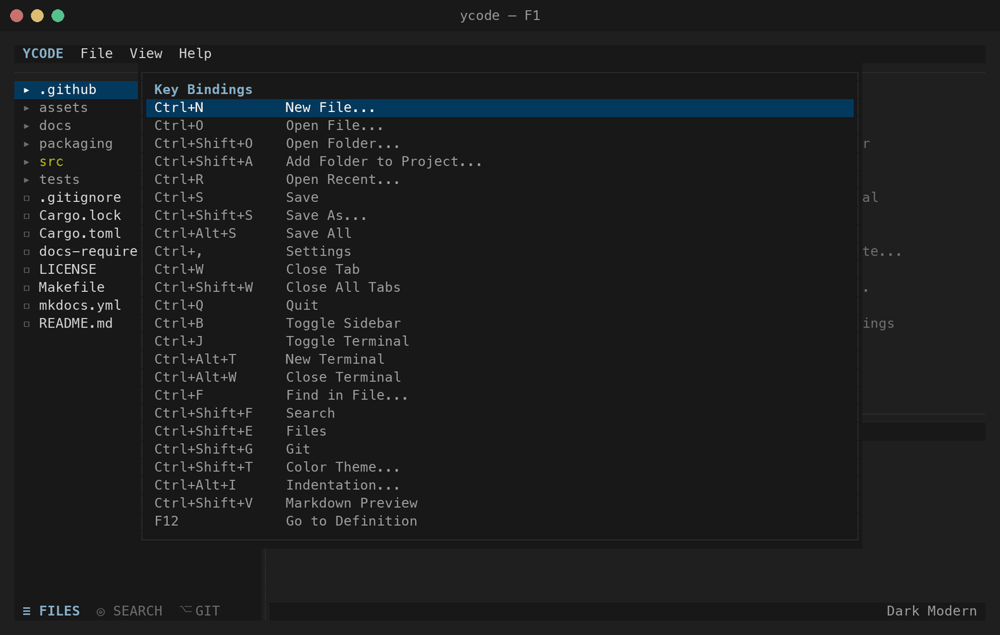
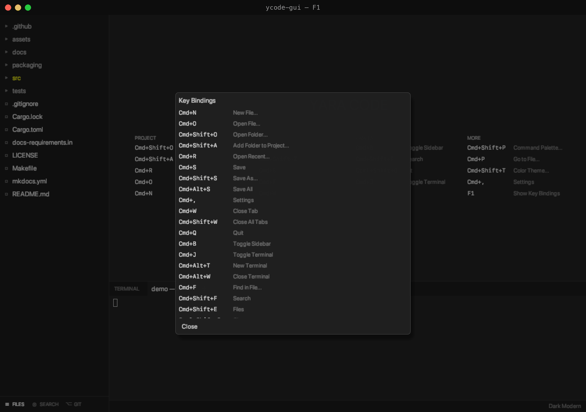

<div align="center">

# Yara Code

**A lightweight code editor for agent-driven development — a terminal UI and a
GPU window that mirror each other, in one small Rust binary.**

[](https://github.com/vsdudakov/yara-code/actions/workflows/ci.yml)
[](https://github.com/vsdudakov/yara-code/releases)
[](https://vsdudakov.github.io/yara-code/)
[](#development)
[](https://www.rust-lang.org/)
[](LICENSE)

📖 **[Documentation](https://vsdudakov.github.io/yara-code/)** ·
🚀 **[Install](#install)** ·
⌨️ **[Key bindings](https://vsdudakov.github.io/yara-code/guides/keys/)**

</div>

| `ycode` — the terminal | `ycode-gui` — the window |
| --- | --- |
|  |  |

<div align="center">

<sub>The same editor twice, on the same folder: the navigator tints what the
agent touched, the gutter marks the lines it changed, and the shell it is
running in stays in the same window.</sub>

</div>

---

```bash
brew install vsdudakov/tap/yara-code   # macOS: the app, icon and all
ycode ~/code/project                   # the terminal editor
ycode-gui ~/code/project               # the same editor, in a window
```

Debian, Fedora, Arch, Windows and plain binaries are all in [Install](#install).

## Why Yara Code exists

You write code with an agent now — **Claude Code**, **Cursor CLI**, **Codex
CLI**, **Aider** — and the agent lives in a terminal. What you actually do all
day is *read*: open the files it touched, read the diff, fix a line it got
wrong, run the tests. A full IDE is the wrong tool for that job — it spends its
startup time, its memory and its screen on a language server, a debugger, a
marketplace and a git GUI you no longer use.

Yara Code is the small editor for that loop. It **views files and diffs, edits a
few lines, and stays out of the way** — with the agent right there in the
built-in terminal.

|  | |
| --- | --- |
| **No LSP** | No indexing, no background language servers, no "loading workspace". Go-to-definition is a fast keyword jump; your agent knows the codebase better than an index would. |
| **No git UI to learn** | Status, diffs and blame are *shown*; every git command you actually run, you run in the terminal, where you already run them. |
| **Nothing else** | No plugin marketplace, no debugger, no telemetry, no Electron. One Rust crate, 25k lines of it; the Debian package carrying **both** binaries is 7.8 MB. |
| **Two frontends, one core** | `ycode` is a terminal UI that runs over SSH; `ycode-gui` is the same editor drawn by the GPU. Same panes, same menus, same keys. |

If you want a lightweight **alternative to VS Code and Zed** for reviewing what
an AI agent wrote — and nothing more — that is exactly what this is.

## What it looks like

Every pair below is the same moment in both frontends — the terminal on the
left, the window on the right.

### Read the diff without leaving the editor

Changed files are tinted in the navigator and changed lines marked in the
gutter. Enter on a file in the git panel opens a **side-by-side diff** in a tab
of its own; the status bar carries blame for the line under the cursor —
commit, author, age, and the pull request its message names.

| Terminal | Window |
| --- | --- |
|  |  |

### Search the whole project

One box, VS Code's glob spelling in the exclude field, every match highlighted
in place. The same parts build the find-and-replace form for the open file, and
**Replace All** is a single undo step.

| Terminal | Window |
| --- | --- |
|  |  |

### Read what the agent wrote as prose

`Ctrl+Shift+V` / `Cmd+Shift+V` renders the open markdown beside it — headings,
lists, tables, task lists and mermaid charts. The window has proportional type
and real rules to draw it with; the terminal has characters, and uses them.

| Terminal | Window |
| --- | --- |
|  |  |

### Themes that came from somewhere

Dark Modern, Dark+, Light+ and Monokai ship built in, and any VS Code color
theme JSON works if you want another. Syntax highlighting comes from 75+
syntect grammars. A theme is data, so both frontends read the same file.

| | Terminal | Window |
| --- | --- | --- |
| **Light+** |  |  |
| **Monokai** |  |  |

### Keys you already know, and a way to see them

VS Code's bindings, with `Ctrl` for `Cmd` in the terminal. Every one of them is
rebindable in a commented `settings.json` that applies the moment it is saved.
<kbd>F1</kbd> shows the lot, always current, because the overlay is generated
from the same table the editor dispatches on.

| Terminal | Window |
| --- | --- |
|  |  |

### In motion

The same tour in each: open the git panel, read the diff, jump to the file,
search the project, render the markdown, change the theme.

**`ycode` — the terminal frontend**


**`ycode-gui` — the window frontend**


## Install

```bash
brew install vsdudakov/tap/yara-code   # macOS: the app, icon and all
brew install vsdudakov/tap/ycode       # the two commands alone
```

Every install — Homebrew, `.deb`, `.rpm`, the AUR package, the plain archives —
puts **both** `ycode` and `ycode-gui` on your `PATH`. The editor is called
Yara Code; the commands are `ycode`, because `yara` already belongs to
VirusTotal's malware scanner in every package manager.

On Linux there are repositories, so the package manager keeps it up to date
like anything else on the machine — `amd64`/`x86_64` and `arm64`/`aarch64` both:

```bash
# Debian, Ubuntu, Mint — the key and the source, once
curl -fsSL https://vsdudakov.github.io/packages/apt/ycode.gpg \
  | sudo tee /usr/share/keyrings/ycode.gpg > /dev/null
echo "deb [signed-by=/usr/share/keyrings/ycode.gpg] https://vsdudakov.github.io/packages/apt stable main" \
  | sudo tee /etc/apt/sources.list.d/ycode.list > /dev/null
sudo apt update && sudo apt install ycode

# Fedora, RHEL, openSUSE
sudo curl -fsSL -o /etc/yum.repos.d/ycode.repo https://vsdudakov.github.io/packages/yum/ycode.repo
sudo dnf install ycode

# Arch, from the release PKGBUILD
makepkg -si
```

Plain binaries for macOS (Apple Silicon and Intel), Linux x86_64 and arm64, and
Windows x64 are on the
[releases page](https://github.com/vsdudakov/yara-code/releases/latest);
`cargo build --release` builds both from source. On a server, build the terminal
frontend alone — it pulls no graphics stack at all:

```bash
cargo build --release --no-default-features --features tui
```

## What it does

| | |
| --- | --- |
| 📂 **Read what the agent changed** | Changed files tinted in the navigator, changed lines marked in the gutter, a **side-by-side diff** in a tab of its own, blame for the line under the cursor — commit, author, age, and the pull request its message names. |
| ✏️ **Fix a line, not a project** | Tabs, smart indent with indent guides, folding with sticky scroll, undo/redo over everything (including Replace All), find & replace in the file and across the project, a rendered **markdown preview** in both frontends. |
| 🖥 **The agent stays in view** | A real login shell on a pseudo-terminal in both frontends — tab completion, full-screen programs, 5000 lines of scrollback. Session tabs say what is running (`yara-code — claude`), and can be renamed and reordered. |
| 🗂 **Several folders, one window** | "Add Folder to Project" — search, go-to-definition and the navigator treat them as one project. |
| 🎨 **Themes and syntax** | Four built-in themes (Dark Modern, Dark+, Light+, Monokai); any VS Code color theme JSON; 75 syntect grammars plus bundled TypeScript, TOML, Kotlin, Swift, Dart, Dockerfile, Protobuf and GraphQL. |
| ⌨️ **Keys you already know** | VS Code bindings, `Ctrl` for `Cmd` in the terminal, every one of them rebindable in a commented `settings.json` that applies the moment it is saved — with a per-project `.ycode/settings.json` on top. |

## Usage

```bash
ycode                         # opens with no project — the start page lists the keys
ycode ~/code/project          # opens that folder
ycode ~/code/project/main.rs  # opens that file, its folder as the project
ycode-gui ~/code/project      # the window
```

| Action | Terminal | Window |
| --- | --- | --- |
| Save / Save As… | `Ctrl+S` / `Ctrl+Shift+S` | `Cmd+S` / `Cmd+Shift+S` |
| Find in file / Search project | `Ctrl+F` / `Ctrl+Shift+F` | `Cmd+F` / `Cmd+Shift+F` |
| Git panel / Terminal panel | `Ctrl+Shift+G` / `Ctrl+J` | `Ctrl+Shift+G` / `Cmd+J` |
| Undo / Redo | `Ctrl+Z` / `Ctrl+Shift+Z` | `Cmd+Z` / `Cmd+Shift+Z` |
| Command palette / Go to file | `Ctrl+Shift+P` / `Ctrl+P` | `Cmd+Shift+P` / `Cmd+P` |
| Markdown preview / Color theme | `Ctrl+Shift+V` / `Ctrl+Shift+T` | `Cmd+Shift+V` / `Cmd+Shift+T` |
| Key bindings overlay | `F1` | `F1` |

The full table is in the [key bindings guide](https://vsdudakov.github.io/yara-code/guides/keys/).

## Documentation

| Page | What it covers |
| --- | --- |
| [Installation](https://vsdudakov.github.io/yara-code/getting-started/installation/) | Homebrew, binaries, building from source |
| [First run](https://vsdudakov.github.io/yara-code/getting-started/first-run/) | The start page, opening a folder, the panes |
| [Project folders](https://vsdudakov.github.io/yara-code/guides/project-folders/) | Several folders in one window |
| [Editing](https://vsdudakov.github.io/yara-code/guides/editing/) | Tabs, folding, smart indent, undo |
| [Search & replace](https://vsdudakov.github.io/yara-code/guides/search/) | Project search, find in file, excludes |
| [Git](https://vsdudakov.github.io/yara-code/guides/git/) | Status, diffs, gutter marks, blame |
| [Terminal](https://vsdudakov.github.io/yara-code/guides/terminal/) | The integrated shell and its tabs |
| [Themes & syntax](https://vsdudakov.github.io/yara-code/guides/themes/) | VS Code themes and grammars |
| [Key bindings](https://vsdudakov.github.io/yara-code/guides/keys/) | Every default, and how to rebind |
| [Settings](https://vsdudakov.github.io/yara-code/guides/settings/) | `settings.json`, field by field |
| [Architecture](https://vsdudakov.github.io/yara-code/architecture/) | How one core drives two frontends |

## Development

```bash
make lint      # cargo fmt --check + clippy -D warnings — the CI gate
make test      # cargo test --all-features
make coverage  # cargo llvm-cov, with the 90% gate on src/core
make build     # release build of both binaries
make run ARGS=~/code/project
```

**Coverage.** 369 tests, **81% of the crate**: 92% of `src/core` — buffers
and undo, project folders, search, find and replace, diffs, git against a real
repository, themes, settings and key chords, the updater, terminal sessions
over live PTYs — and the two frontends driven **end to end**. `tests/tui_e2e.rs`
runs the real terminal editor on ratatui's test backend and reads the frame
back; `tests/gui_e2e.rs` runs the real window on a bare egui context with
synthetic keys and clicks. Between them they cover 94% of the terminal's
drawing and 61% of the window's. CI gates `src/core` at 90%.

Pull requests must pass `make lint` and `make test`; CI runs them on Linux,
macOS and Windows, and separately builds the terminal frontend with no graphics
stack to keep it headless-safe. See
[Contributing](https://vsdudakov.github.io/yara-code/contributing/).

## License

MIT — see [LICENSE](LICENSE).
