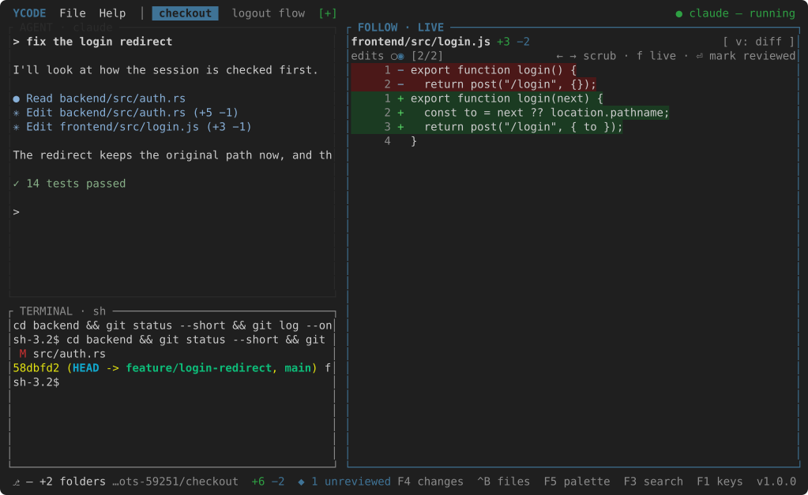

<div align="center">

# Yara Code

**The terminal editor for the agent loop: your coding agent on the left, the
diff of what it just did on the right.**

[](https://github.com/vsdudakov/yara-code/actions/workflows/ci.yml)
[](https://github.com/vsdudakov/yara-code/releases)
[](https://vsdudakov.github.io/yara-code/)
[](https://www.rust-lang.org/)
[](LICENSE)

📖 **[Documentation](https://vsdudakov.github.io/yara-code/)** ·
🚀 **[Install](#install)** ·
⌨️ **[Keys](https://vsdudakov.github.io/yara-code/guides/keys/)**

</div>


```bash
brew install vsdudakov/tap/ycode
ycode ~/code/project
```

## The loop

You write code with an agent now — Claude Code, Codex, Cursor's CLI — and the
agent lives in a terminal. What you do all day is *watch it work*: read the
diff it just made, decide whether it is right, tell it what to do next. Yara
Code is one screen for exactly that, and nothing else.

- **AGENT** is the agent itself, on a real pseudo-terminal in the left pane.
  Type at it as you would anywhere; it keeps every key it uses.
- **FOLLOW** watches the folders you work in. Every edit lands on a timeline
  and the pane snaps to its diff: `←` `→` scrub back, `⏎` marks one reviewed,
  `f` returns to live, `v` shows the file instead of the diff.
- **CHANGES** (`F4`) is the same work from the other end: what the branch
  differs from `main` by, file by file, headed by each repository.
- **Tasks** are tabs: `F7` names one, gets a git worktree for every
  repository you work in, starts an agent there, and follows it.

## Workspaces and tasks

A **workspace** is what you work on — a list of folders. Repositories,
usually; a folder that holds several of them, often; any folder at all, if
that is the work. `File` adds them, takes them out and remembers them.

A **task** is what an agent is doing — a tab, with its own agent, its own
timeline and its own CHANGES, working in the workspace's folders or in a
worktree of its own for each of them. Two agents on two tasks at once, each
in a branch of its own, is the point.


## What it looks like

| | |
| --- | --- |
|  |  |
| *Scrubbed back: the pane pauses, reviewed edits are hollow ticks.* | *`v`: the same edit as the file, a bar beside every added line.* |
|  |  |
| *CHANGES: the branch against main, headed by each repository.* | *`Ctrl+T`: a shell under the agent, in the task's folder.* |
|  |  |
| *A file from the tree, open where the follow pane was.* | *`F3`: search every folder; `⏎` opens the hit on its line.* |
|  |  |
| *`F5`: any command by a few letters.* | *`F1`: every command and its chord, always current.* |

## Install

```bash
brew install vsdudakov/tap/ycode            # macOS and Linux
```

```bash
# Debian, Ubuntu — the key and the source, once
curl -fsSL https://vsdudakov.github.io/packages/apt/ycode.gpg \
  | sudo tee /usr/share/keyrings/ycode.gpg > /dev/null
echo "deb [signed-by=/usr/share/keyrings/ycode.gpg] https://vsdudakov.github.io/packages/apt stable main" \
  | sudo tee /etc/apt/sources.list.d/ycode.list > /dev/null
sudo apt update && sudo apt install ycode

# Fedora, RHEL, openSUSE
sudo curl -fsSL -o /etc/yum.repos.d/ycode.repo https://vsdudakov.github.io/packages/yum/ycode.repo
sudo dnf install ycode

# Arch, from the release PKGBUILD
makepkg -si

# Anywhere with a Rust toolchain
cargo install --git https://github.com/vsdudakov/yara-code ycode
```

Plain binaries for macOS (Apple Silicon and Intel), Linux (x86_64 and arm64)
and Windows are on the
[releases page](https://github.com/vsdudakov/yara-code/releases/latest). The
command is `ycode` because `yara` belongs to VirusTotal's scanner in every
package manager.

## Usage

```bash
ycode                    # the start page: workspaces opened before
ycode ~/code/project     # open that folder as a workspace
```

The agent is whatever `"agent"` in `settings.json` says — `claude` by
default; `codex`, `cursor-agent`, or a path to any of them, arguments and
all. `File → Settings` (`F12`) opens the file, every key commented.

| | Key |
| --- | --- |
| Switch pane (agent → terminal → files → editor / follow) | `F6` |
| Scrub the timeline · go live · mark reviewed · diff/file | `←` `→` · `f` · `⏎` · `v` |
| Changes vs main · palette · search · go to file · files · terminal | `F4` · `F5` · `F3` · `Ctrl+P` · `Ctrl+B` · `Ctrl+T` |
| New task · rename · next / previous · close | `F7` · `F2` · `Ctrl+L` / `Ctrl+K` · `Ctrl+W` |
| Save · close the file · undo / redo · copy / paste | `Ctrl+S` · `Esc` · `Ctrl+Z` / `Ctrl+Y` · `Ctrl+C` / `Ctrl+V` |
| Keys · menus · recent · theme · agent usage · quit | `F1` · `F10` · `Ctrl+R` · `F9` · `F8` · `Ctrl+Q` |

With the agent focused, plain keys, `⏎`, `Esc`, `Tab` and the arrows are the
agent's; a function key or a bound `Ctrl` chord is the editor's, except the
ones `"agent_keys"` lists, which agents use themselves. The defaults need
nothing a terminal cannot send: no `Ctrl+Shift`, no `Alt`.

## Development

```bash
make lint     # cargo fmt --check + clippy -D warnings
make test     # cargo test --workspace
make shots    # redraws docs/assets/shots/*.svg with the editor itself
make run ARGS=~/code/project
```

Two crates: `crates/yara-core` is everything the editor knows — the follow
loop, git, the agent's pty and keyboard protocol, settings, themes, search —
and `crates/ycode` is the terminal that shows it, with end-to-end tests that
drive the real app on ratatui's test backend and read the frame back.

## License

MIT — see [LICENSE](LICENSE).
