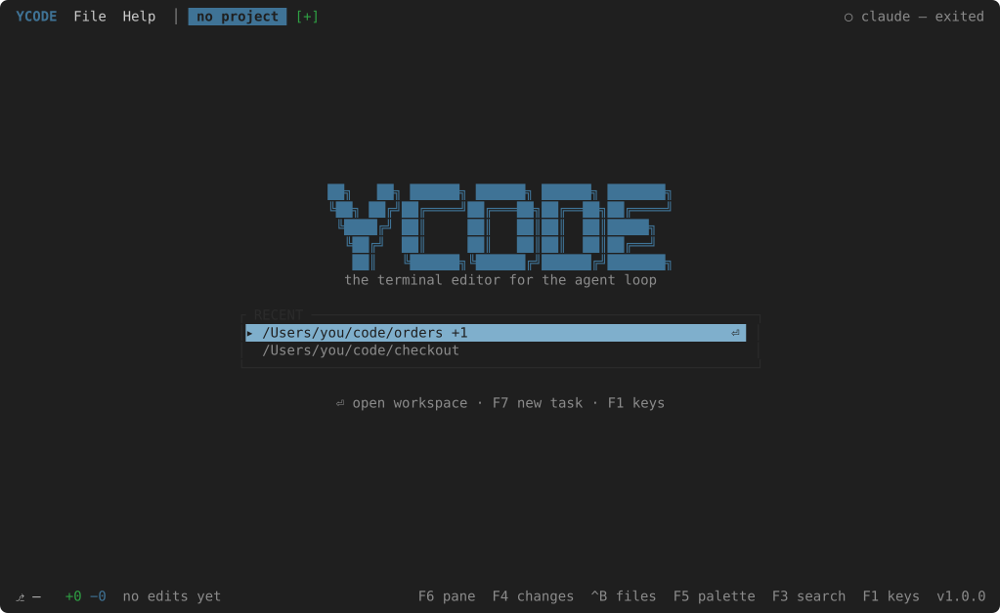

# First run

```bash
ycode
```

With no folder named, the start page lists the workspaces opened before.
++enter++ opens the one under the cursor.



Without any yet, `File → New Task…` (++f7++) asks for a folder: walk to it —
type to narrow the list, ++enter++ to step into a folder — and ++enter++ on
the first row adds the one the walk stands on. That folder becomes the
workspace, and the agent starts in it.

```bash
ycode ~/code/project
```

With a folder named, the two panes come up straight away. The agent is
`claude` unless [settings](../guides/settings.md) say otherwise, and the
keyboard is on it: talk to it.

When it edits a file, the FOLLOW pane shows the diff of that edit and the
status bar counts one unreviewed. ++f6++ moves the keyboard to the follow
pane; ++enter++ marks the edit reviewed and moves to the next; ++f4++ shows
what the whole branch differs from `main` by.

That is the loop. The rest is in the guides:

- [The follow loop](../guides/follow.md) — live, paused, reviewed; diff and file.
- [Workspaces and tasks](../guides/tasks.md) — the folders, and an agent per task.
- [The terminal](../guides/terminal.md) — a shell under the agent.
- [Files and editing](../guides/editing.md) — the tree, the editor, saving.
- [Key bindings](../guides/keys.md) — which keys are the agent's and which the editor's.
