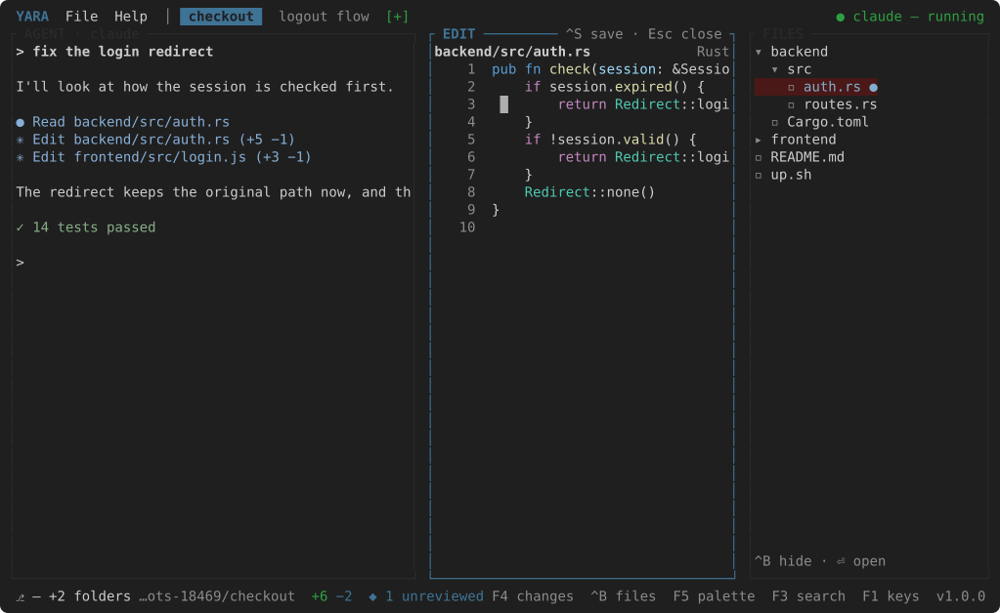

# Files and editing

Yara Code is not where you write the code; the agent does that. It is where you
fix a line. So the editor is small, and it opens where the follow pane was.

## The tree

++ctrl+b++ shows FILES and puts the keyboard on it. ++up++ ++down++ move,
++enter++ opens a folder or a file, ++ctrl+b++ hides it again. Files the branch
changed are tinted with a `●`; the open file has its row lit. With several
folders in the workspace, each heads its own rows.

A right click offers **New File** and **New Folder**, made where the cursor is.
The tree sits at the edge away from the agent, and the column between it and
the pane beside it is a seam: drag it to set the tree's width.

## The editor

A file opens with the title **EDIT**, its path, a `●` while it has unsaved
changes, and the name of its grammar on the right. Every key is typing except:

| | Key |
| --- | --- |
| Save | ++ctrl+s++ — `✓ saved <path>` in the status bar |
| Close, back to the follow pane | ++esc++ — a file with unsaved changes asks first |
| Undo / redo | ++ctrl+z++ / ++ctrl+y++ — a run of typing is one step |
| Copy / paste | ++ctrl+c++ / ++ctrl+v++ — drag with the mouse to select |
| Move | arrows, ++home++, ++end++, a click, the wheel; ++tab++ inserts four spaces |

A save is a change to the working tree like any other, so it lands on the
timeline too.

## Go to file

++ctrl+p++ finds a file by a few letters — `gd` finds `docs/guide.md` — across
every folder of the workspace, each hit named by its folder. ++ctrl+n++ makes a
new file and opens it. `File → Settings` (++f12++) opens `settings.json` the
same way, even with no folder open.
