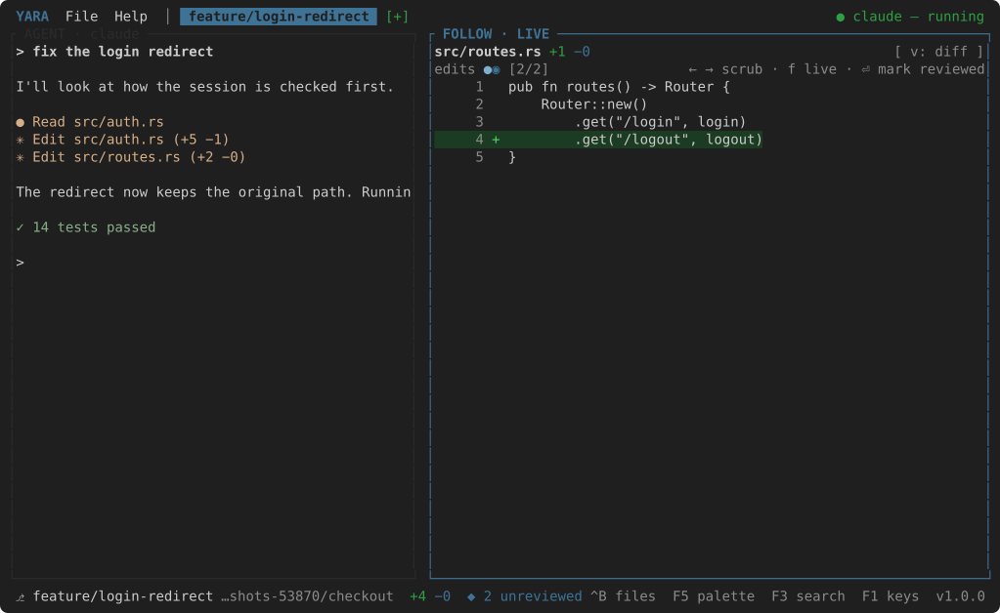
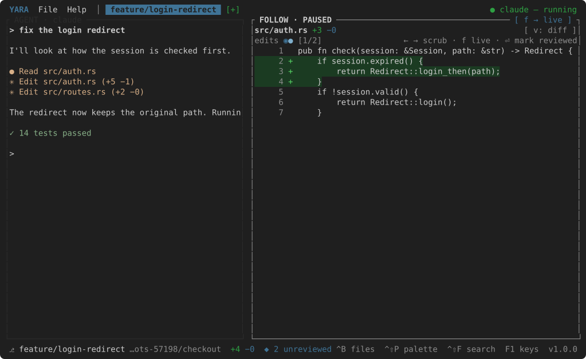
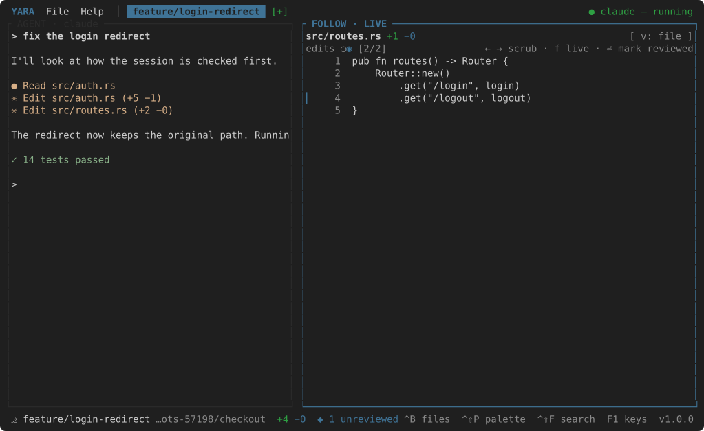
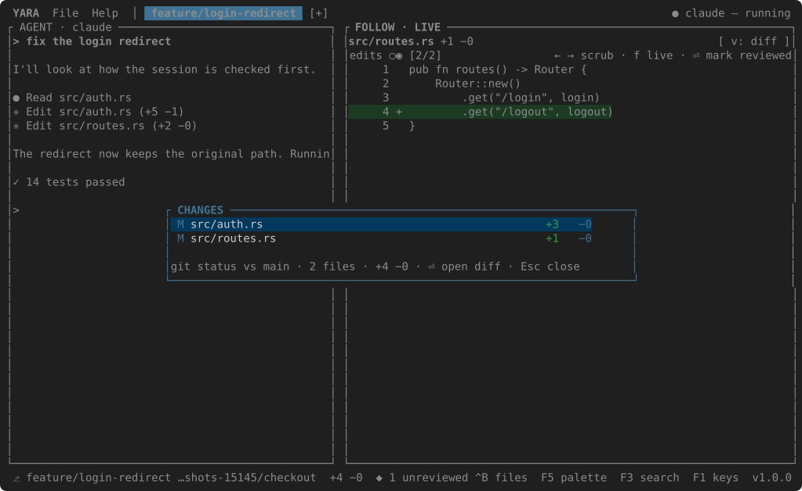

# The follow loop

The FOLLOW pane watches the working tree of the project. Every half second
(`refresh_ms`) it looks at what changed; every file whose text moved since
the last look becomes an **edit** on the timeline — the step the agent just
took, not the whole distance from `main`. A file put back the way it was is
an edit too.

## Live

While the pane is **LIVE** its border is lit and it snaps to the newest edit
as it lands. The file row names the file with its `+added −removed`; the
timeline row draws one tick per edit: `◉` the current one, `●` unreviewed,
`○` reviewed. Past `timeline_ticks` (twelve) the strip windows around the
current edit with `‥` at the ends.

## Paused

++left++ and ++right++ scrub through the edits and pause the pane — the
title says **PAUSED** and offers `[ f → live ]`. New edits still join the
timeline; the pane stays where you put it. ++f++, or stepping onto the newest
edit, goes live again. Clicking a tick jumps to it.

## Reviewing

++enter++ marks the current edit reviewed and moves to the oldest edit that
is not; when none remain the pane goes live. The status bar shows
`◆ N unreviewed`, and clicking it jumps to the next unreviewed edit; once
everything is reviewed it reads `✓ all reviewed`.

## Diff and file

The body is the unified diff of the edit: gutter, line number, `+` or `−`,
the line, added rows on a green ground and removed rows on a red one.
++v++ toggles to the **file** as it stands now, with a bar beside every line
this edit added.

## CHANGES

++f4++ opens CHANGES: what the branch differs from `main` by, one
row a file — `A` added, `M` modified, `D` deleted, `U` untracked — with its
counts, and the totals in the footer. It is the *result*; the timeline is
the *history*. ++enter++ on a row opens that file's whole diff in the follow
pane (`FOLLOW · CHANGES`), and ++esc++ returns to the timeline.

`main` is the branch the repository's main working copy has checked out,
unless `base_branch` in settings names another. In a worktree the base is the
merge base with it, so a branch that has already committed still shows
everything it did.
