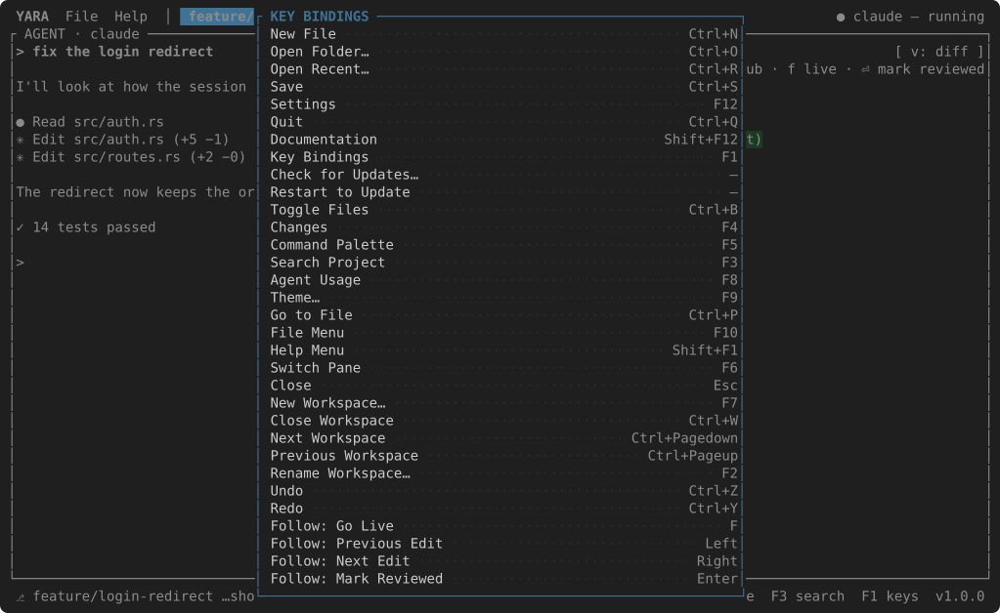

# Key bindings

++f1++ shows every command and its chord, always current, because the overlay
is drawn from the same table the editor dispatches on.



## Whose key is it

With the keyboard on the **agent** or the **terminal**, plain keys, ++enter++,
++esc++, ++tab++ and the arrows are theirs, whatever the editor binds them to —
they are how a program is talked to. A bound ++ctrl++ or ++alt++ chord, or a
function key, is the editor's, except the ones `agent_keys` lists — ++ctrl+r++,
++ctrl+n++, ++ctrl+z++, ++ctrl+w++, ++ctrl+y++, ++ctrl+c++ by default — which
the programs use themselves. ++ctrl+c++ with text selected copies it all the
same, and ++ctrl+v++ pastes the clipboard at the program whatever the list
says. Chords nobody bound reach the agent.

With the keyboard in the **editor**, everything is typing except ++esc++, which
closes the file, and the bound ++ctrl++ chords and function keys.

++f6++ moves the keyboard round: agent → terminal (when open) → files (when
shown) → editor or follow pane → agent. A click moves it too.

## The defaults

| Command | Key |
| --- | --- |
| Open Recent Workspace… | ++ctrl+r++ |
| Add Folder to Workspace… | — the File menu and the palette |
| Remove Folder… | — the File menu and the palette |
| New Task… | ++f7++ |
| Close Task | ++ctrl+w++ |
| Next / Previous Task | ++ctrl+l++ / ++ctrl+k++ |
| Rename Task… | ++f2++ |
| New File | ++ctrl+n++ |
| New Folder | — a right click in the tree |
| Save | ++ctrl+s++ |
| Settings | ++f12++ |
| Local Settings | — the File menu and the palette |
| Quit | ++ctrl+q++ |
| Toggle Files | ++ctrl+b++ |
| Terminal | ++ctrl+t++ |
| Changes | ++f4++ |
| Command Palette | ++f5++ |
| Search Project | ++f3++ |
| Go to File | ++ctrl+p++ |
| Agent Usage | ++f8++ |
| Theme… | ++f9++ |
| Key Bindings | ++f1++ |
| File Menu | ++f10++ — ++right++ for Help |
| Switch Pane | ++f6++ |
| Copy / Paste | ++ctrl+c++ / ++ctrl+v++ |
| Undo / Redo | ++ctrl+z++ / ++ctrl+y++ |
| Close | ++esc++ |
| Follow: Go Live | ++f++ |
| Follow: Previous / Next Edit | ++left++ / ++right++ |
| Follow: Mark Reviewed | ++enter++ |
| Follow: Diff / File | ++v++ |

## Rebinding

Only the bindings that differ need listing:

```json
"keys": { "follow_live": "L", "changes": "Ctrl+G" }
```

Chords are `Ctrl`/`Alt`/`Shift` and a key — `Ctrl+G`, `Alt+Left`, `Shift+F3` —
or a bare key like `F` for the follow pane. A chord that cannot be read keeps
its default and is named in the status bar; one given to two commands is
reported too. The defaults use only what every terminal sends; a `Ctrl+Shift`
rebinding works where the kitty keyboard protocol does — Ghostty, kitty,
WezTerm, foot, iTerm2 3.5 and later.
