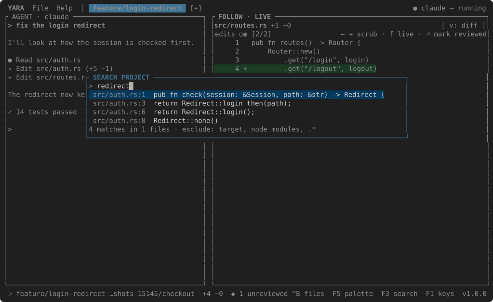
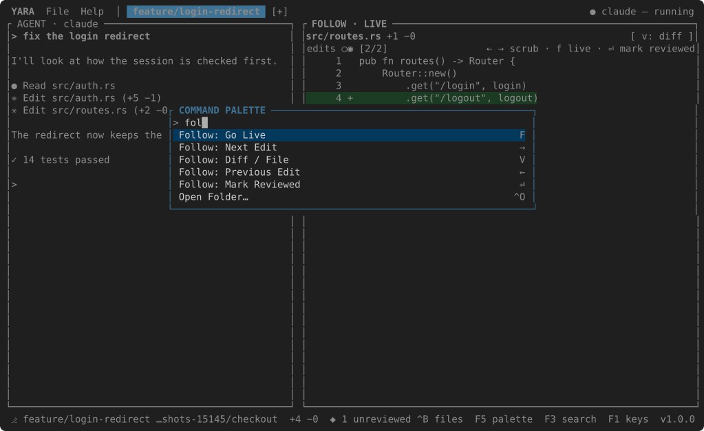
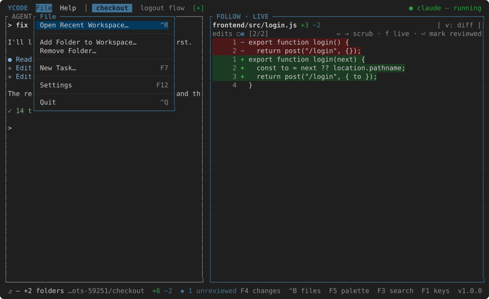

# Search and the palette

## Search the project

++f3++ opens SEARCH PROJECT. Type; every line containing the
text, in any file under the project, is listed as `path:line  text`. The
footer counts matches and files and names what was left out —
`search_exclude` in [settings](settings.md), `target`, `node_modules` and
dot-folders by default, in VS Code's glob spelling. ++enter++ opens the hit
with the caret on its line. Case does not matter; the list stops at five
hundred hits.

## The palette

++f5++ opens the COMMAND PALETTE: every command with its chord on
the right, found by a few letters — `tf` for Toggle Files. ++enter++ runs
it. The menus (++f10++ for File, ++shift+f1++ for Help) hold the same
commands in the order a menu bar would.

