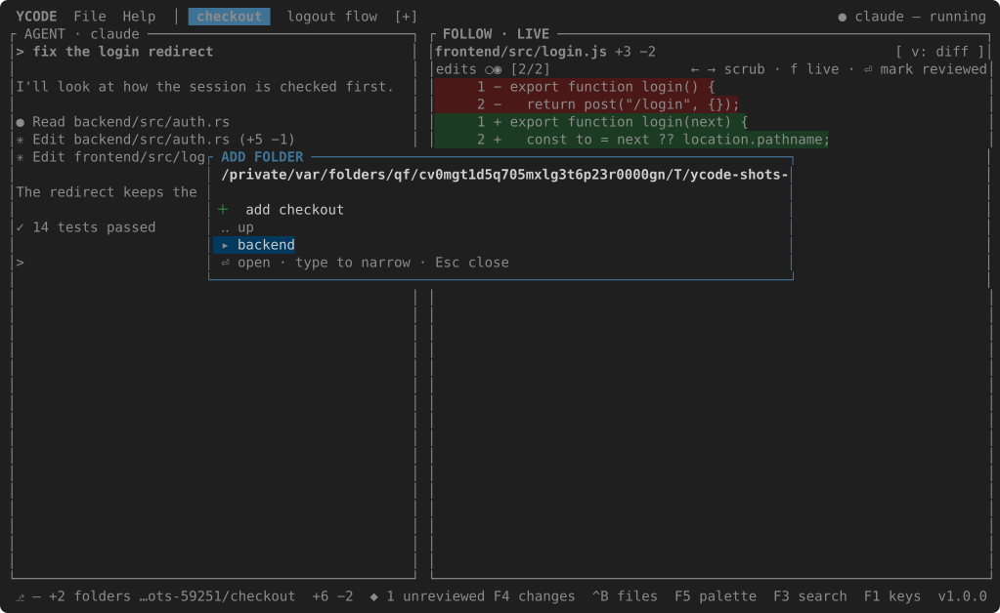
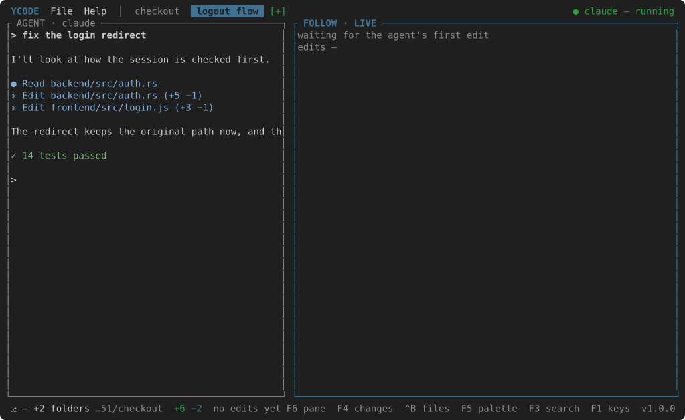
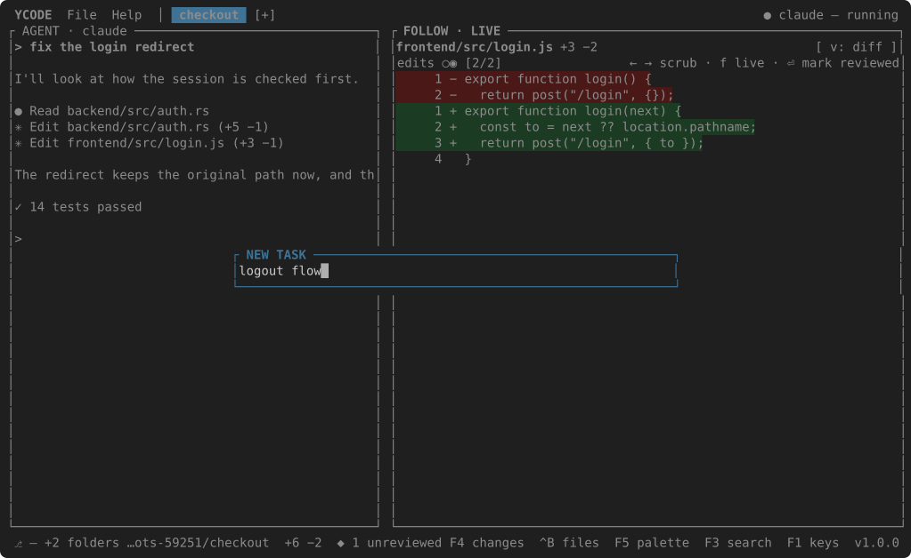

# Workspaces and tasks

Two levels, and the difference is worth holding on to.

**A workspace is what you work on**: a list of folders — repositories,
usually, but any folder will do. It is the `File` menu's business:

| | |
| --- | --- |
| Open Recent Workspace… | ++ctrl+r++ — every workspace opened before, its folders and all |
| Add Folder to Workspace… | walks the filesystem: type to narrow, ++enter++ to step in, ++enter++ on the first row to add the folder the walk stands on |
| Remove Folder… | the workspace's folders; ++enter++ takes one out |

**A task is what an agent is doing**: a tab, with its own agent, its own
timeline and its own CHANGES. Every task works in the workspace's folders — or
in a worktree of its own for each of them.

++f7++ — or `[+]` in the header, or `File → New Task…` — asks for a name. For
every folder of the workspace that is a repository it makes a worktree on a
branch of that name; folders that are not repositories are shared as they are.
An agent starts in the result, and the tab is called by the name.

| | Key |
| --- | --- |
| New task | ++f7++ |
| Next / previous | ++ctrl+l++ / ++ctrl+k++, or click the tab |
| Rename | ++f2++, or a right click on the tab |
| Delete the task | a right click on the tab — its worktrees go, their branches stay |
| Close the tab | ++ctrl+w++ — the agent stops, the worktrees stay |
| Reorder | drag a tab along the strip |

The first task, the one without a name of its own, works in the workspace's
folders themselves. It is called by its pull request when `gh` is installed and
the branch has one (`#42 Fix the login redirect`), else by its branch, else by
the folder.

Where a task's worktrees go is `worktrees_dir` in [settings](settings.md):
empty means a `<repo>-worktrees` folder beside each repository, and a folder
named there holds one folder per repository, so two repositories never collide.

## Several folders, one task

A feature that touches a backend and a frontend is one workspace with two
folders, and one task across both:

- the timeline carries the edits of both, each named by its folder —
  `frontend/src/login.js`;
- CHANGES heads each folder with its branch and its counts;
- the FILES tree heads each folder, and ++ctrl+p++ and project search reach
  across both;
- the status bar shows the main folder's branch and `+1 folders`.

## Folders that hold repositories

A folder that holds repositories rather than being one — a bench of related
projects, `backend/`, `frontend/`, `python-orbis/` side by side — is followed
through each of them: every repository inside it, two levels deep, is watched
in its own right, heads its own section in CHANGES, and names the edits that
come from it. The bench itself is watched for the loose files around them, and
no file is reported twice.

An agent that sets up a worktree of its own inside one of the task's folders —
`.worktrees/the-branch`, say — is followed there without being asked: the
worktree joins the task while it is there, and leaves when it is removed.

A folder that is not a repository at all is watched the same way: its files are
read rather than asked of git, and their edits land on the timeline like any
other. CHANGES has nothing to say about it, and says so.
