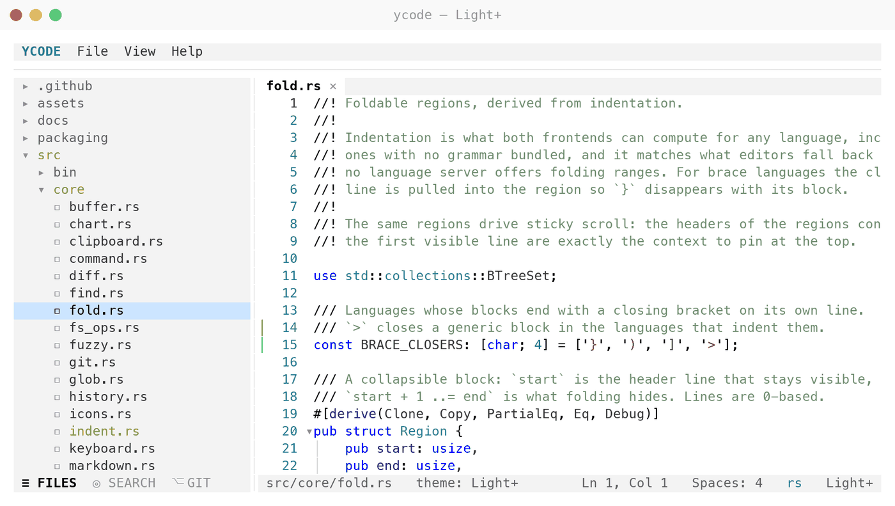
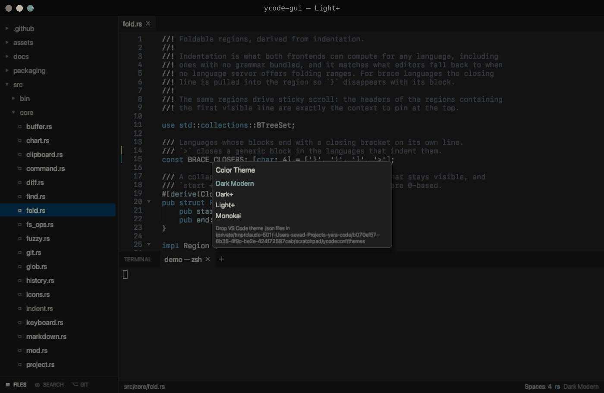
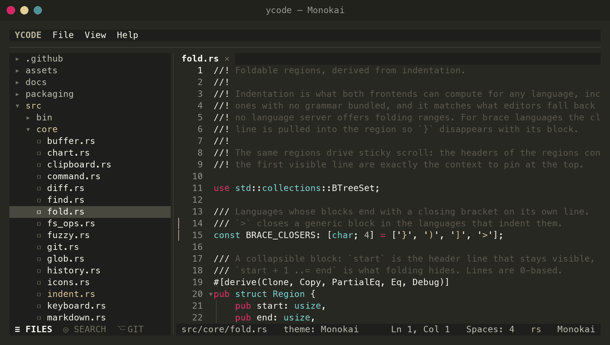
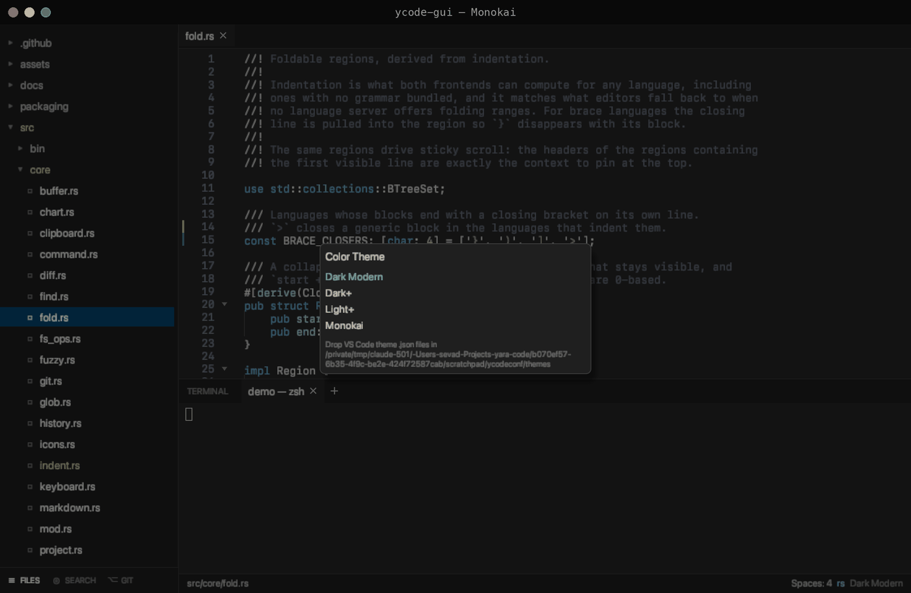

# Themes & syntax

## Themes

Themes are data, not constants. Built in: **Dark Modern**, **Dark+**,
**Light+** and **Monokai**, in that order — Dark Modern leads the picker, and
an install with no `theme` in its settings starts on Dark+. Switch with
`Cmd+Shift+T` / `Ctrl+Shift+T`, or from **View → Color Theme…**.

=== "Light+"

    

    

=== "Monokai"

    

    

=== "Dark Modern"

    

    

Any VS Code color theme works: drop its `.json` into

```
~/.config/ycode/themes/
```

and it appears in the picker. The loader reads the `colors` map (chrome and the
16 ANSI terminal colors) and `tokenColors` (syntax); anything the file omits
falls back to the built-in Dark+ or Light+ value, per the theme's `type`.

The terminal palette is not decoration: git status letters, diff tints and the
editor's gutter marks are all taken from it, so a theme colors them sanely
without knowing anything about Yara Code.

## Syntax

75 syntect grammars ship in the binary, plus bundled ones for TypeScript/TSX,
TOML, Kotlin, Swift, Dart, Dockerfile, Protobuf and GraphQL, and an alias table
pointing the remaining common extensions at their closest relative (`.mjs` →
JavaScript, `.ex` → Ruby, `.zig` → C, `.ini` → TOML…).

Drop any `.sublime-syntax` into

```
~/.config/ycode/syntaxes/
```

to add or replace a language; user grammars win. They load into their own set,
so startup stays at ~40 ms instead of the ~1.2 s a full relink would cost.

## Icons

The terminal frontend uses Unicode glyphs by default. For terminals with sparse
font coverage:

```bash
YARA_ASCII=1 ycode
```
