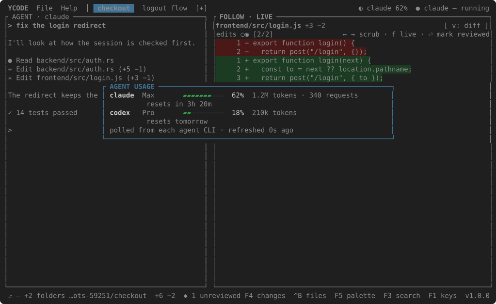

# Agent usage and updates

## Agent usage

The agents only show what is left of their plans from inside their own
sessions — `/usage` in Claude Code and Cursor's CLI, `/status` in Codex — so
++f8++ types that command at the agent and puts the keyboard there. Which
command, by program name, is `usage_slash` in [settings](settings.md).

For a panel of your own, name a command per agent in `usage_commands` that
prints one JSON object. Set, it is what ++f8++ shows instead, and the header
carries a `◐ claude 62%` chip that opens it.



```json
"usage_commands": {
  "claude": "my-claude-usage",
  "codex":  "my-codex-usage"
}
```

```json
{"plan": "Max", "percent": 62, "detail": "1.2M tokens · 340 requests", "reset": "resets in 3h 20m"}
```

The commands run in the background, and the panel says how old its figures
are; an agent whose command fails or prints something else is listed with the
error in its detail.

## Updates

`Help → Check for Updates…` asks GitHub for the latest release. When a newer
one exists and the folder the binary lives in is writable, it is downloaded,
its checksum checked, and it replaces the binary in place — the status bar
says `↓ vX downloaded — restart to apply` and the version chip turns to
`vX ✓`. Otherwise it names the package manager that owns the binary.
