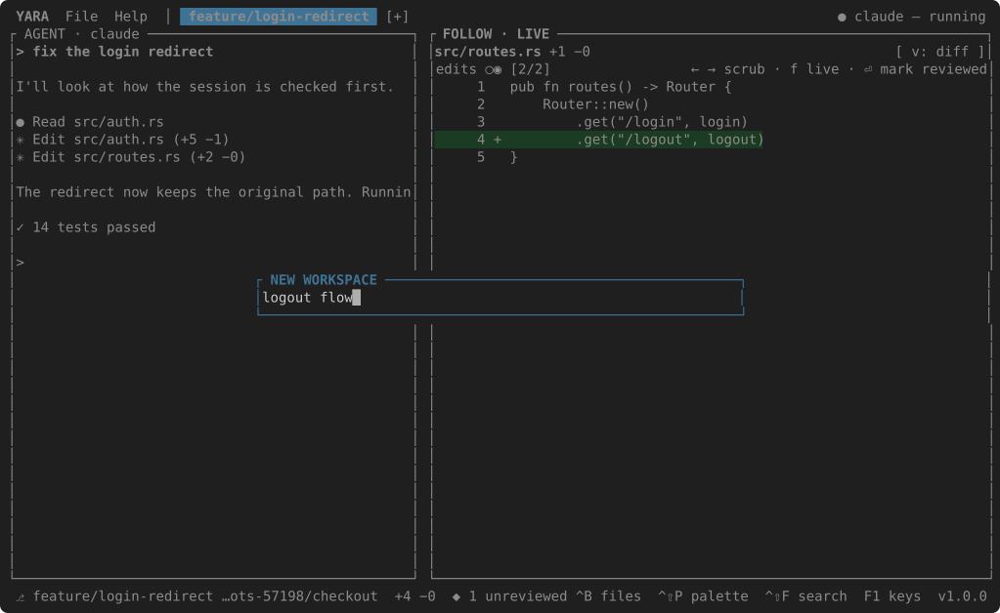

# Workspaces

A workspace is one agent in one git worktree, with its own timeline and its
own CHANGES. The tabs in the header are the workspaces; the first is the
folder you opened.

++f7++ — or `[+]` in the header, or `File → New Workspace…` —
asks for a name. The name becomes the tab, and, with spaces and slashes made
dashes, the branch and the folder: `git worktree add -b logout-flow
<worktrees_dir>/logout-flow`. An agent starts there, and the keyboard goes to
it.

| | Key |
| --- | --- |
| New workspace | ++f7++ |
| Next / previous | ++ctrl+pgdn++ / ++ctrl+pgup++, or click the tab |
| Rename | ++f2++ |
| Close | ++ctrl+w++ — the agent stops; the worktree stays for git |

The first workspace, the one without a name of its own, is called by its
pull request when `gh` is installed and the branch has one (`#42 Fix the
login redirect`), else by its branch, else by its folder.

Where the worktrees go is `worktrees_dir` in [settings](settings.md):
empty means a `<repo>-worktrees` folder beside the repository.
