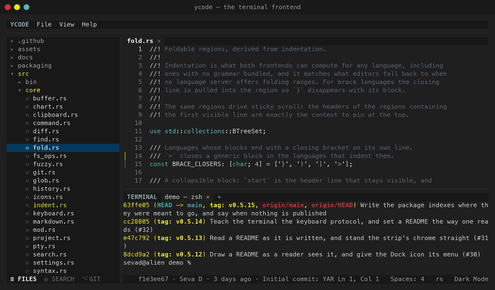
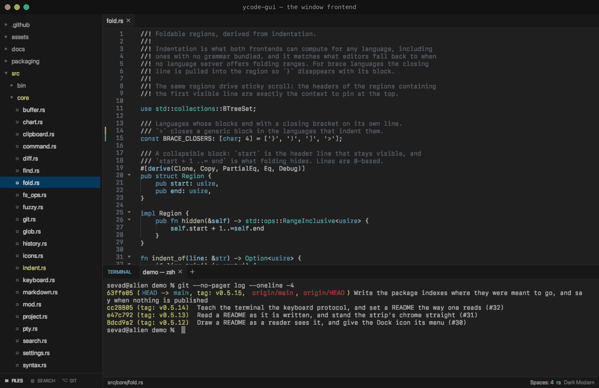
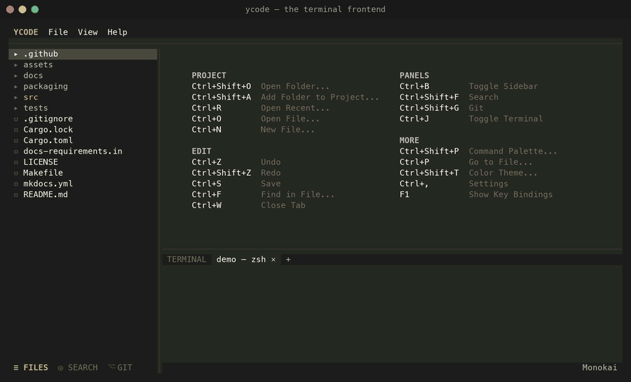
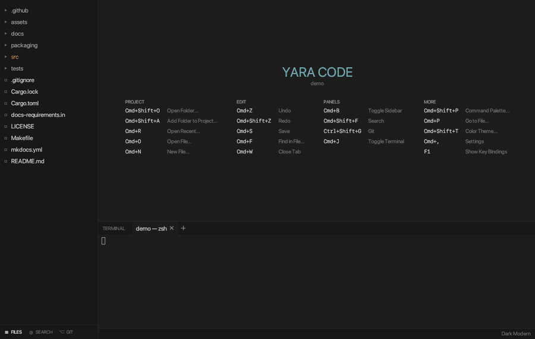

# Yara Code

**A minimal code editor with two frontends over one core — a GPU-accelerated
window and a terminal UI that runs over SSH.**

=== "Terminal"

    

=== "Window"

    


Yara Code is the *same editor* twice. `ycode` draws it with characters (ratatui on
crossterm); `ycode-gui` draws it with the GPU (egui on wgpu). Both are one Rust
crate: the navigator, project search, git, folding, the integrated shell and
every key binding live in `src/core`, and each frontend only paints them and
translates its own input. The terminal you SSH into behaves like the window on
your desk.

```bash
brew install vsdudakov/tap/ycode
ycode ~/code/project        # the terminal frontend
ycode-gui ~/code/project    # the same editor, in a window
```

## What it does

- **Two frontends, one core.** The terminal build pulls no graphics stack at
  all, so it compiles and runs on a headless server.
- **Syntax highlighting** from 75 syntect grammars, plus bundled TypeScript,
  TOML, Kotlin, Swift, Dart, Dockerfile, Protobuf and GraphQL — and any VS Code
  color theme you drop into `~/.config/ycode/themes/`.
- **Project folders**: one window can hold several, and search,
  go-to-definition and the navigator treat them as one project.
- **Search** across the project with an exclude box in VS Code's glob spelling,
  and a find/replace form in the open file built from the same parts.
- **Git**: changed files tinted in the navigator, changed lines marked in the
  gutter, a side-by-side diff in a tab of its own, and blame for the line under
  the cursor.
- **A real shell** on a pseudo-terminal in both frontends; its tabs say what
  is running in them.
- **Markdown preview** — lists, tables, tasks and mermaid charts — and indent
  guides in both frontends.
- **VS Code key bindings**, all rebindable in a commented `settings.json` that
  applies on save, with per-project overrides in `.ycode/settings.json`.

## What it looks like

Every shot below is the terminal frontend; the window draws the same panes with
the same keys.

The tour below runs in both frontends, a step at a time — the git panel, the
diff, the file, project search, the markdown preview, and the themes.

=== "Terminal"

    

=== "Window"

    

## Where to go next

- [Installation](getting-started/installation.md) — Homebrew, prebuilt
  binaries, or a build from source.
- [First run](getting-started/first-run.md) — what the start page offers and
  how the panes fit together.
- [Key bindings](guides/keys.md) — every default, and how to change it.
- [Architecture](architecture.md) — how one core drives two frontends.
