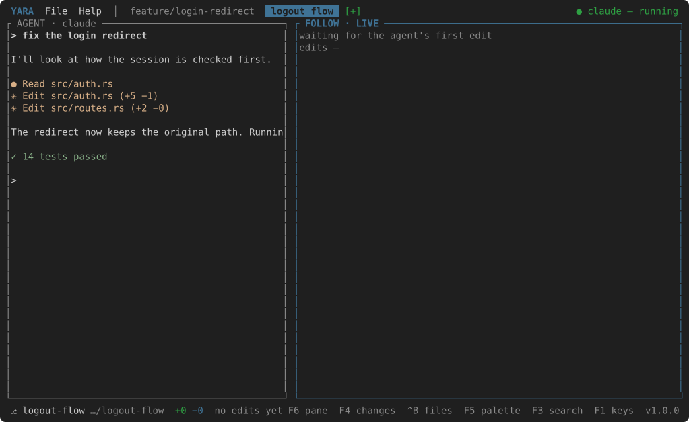

# Yara Code

**The terminal editor for the agent loop: your coding agent on the left, the
diff of what it just did on the right.**


```bash
brew install vsdudakov/tap/ycode
ycode ~/code/project
```

You write code with an agent now — Claude Code, Codex, Cursor's CLI — and the
agent lives in a terminal. What you do all day is *watch it work*: read the
diff it just made, decide whether it is right, tell it what to do next. Yara
Code is one screen for that.

## The two panes

**AGENT** is the agent itself, running on a real pseudo-terminal in the left
pane. Type at it as you would anywhere; it keeps every key it uses.

**FOLLOW** watches the working tree. Every edit the agent makes becomes a
tick on a timeline and the pane snaps to its diff. Scrub back with ++left++
and ++right++, mark an edit reviewed with ++enter++, snap back to live with
++f++, see the file instead of the diff with ++v++. The status bar counts what
is still unreviewed.

**CHANGES** (++f4++) is the other view of the same work: what the
branch differs from `main` by, file by file — the result, beside the timeline
of how it got there.

## Tasks

++f7++ asks for a name, makes a git worktree on a branch of that
name, starts an agent in it and gives it a tab. Two agents on two tasks, each
with its own timeline; ++ctrl+l++ moves between them.



## And the small editor around it

A file tree (++ctrl+b++), a shell under the agent (++ctrl+t++), an editor
with undo and syntax colours for fixing a line (++ctrl+s++, ++esc++), go to
file (++ctrl+p++), project search
(++f3++), a command palette (++f5++), ++f1++ for every
key, and a commented `settings.json` that holds everything you might want
different — the agent command, which side it sits on, its width, the keys.

Start with [Installation](getting-started/installation.md), then
[First run](getting-started/first-run.md).
